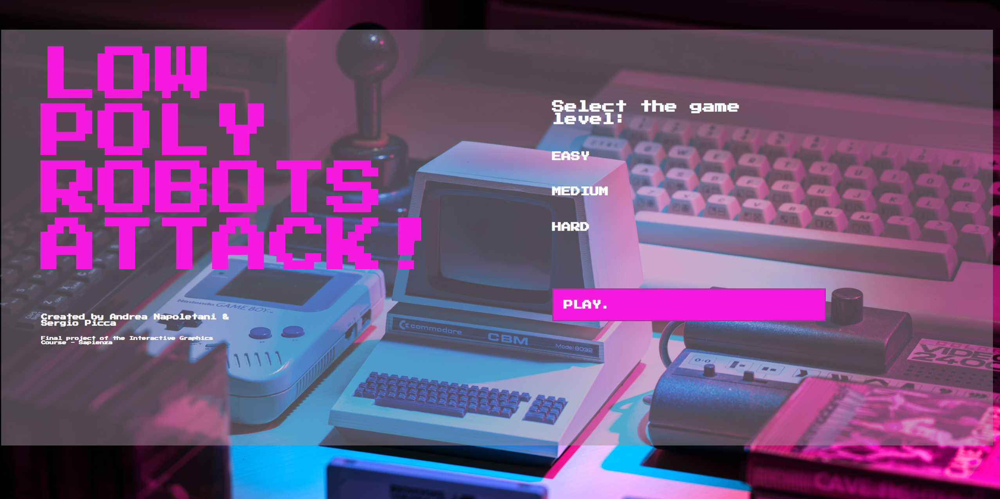
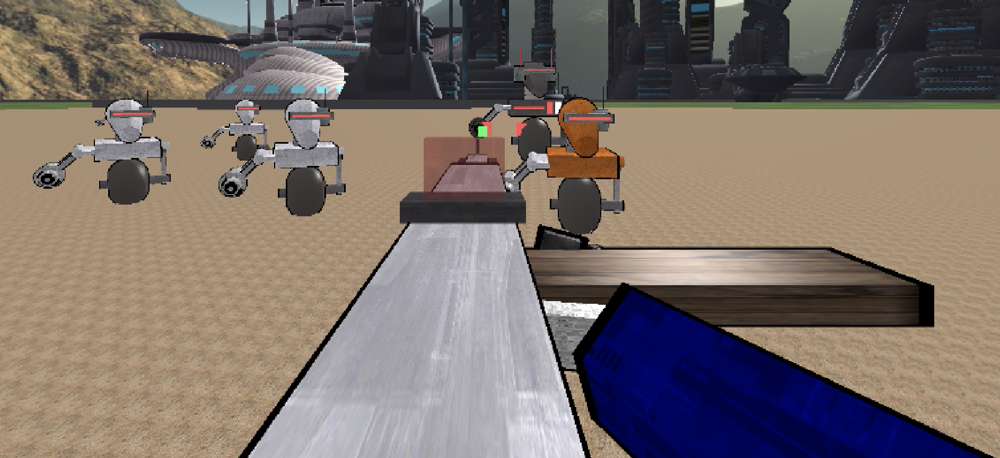

# LOW POLY ROBOTS ATTACKS !

**The idea**

*LOW POLY ROBOTS ATTACKS!* is the name of the final project of the Interactive Graphics course and  is  the  first  release  of  a  3D  cartoon-style-game  set  in  a  sci-fi/futuristic  world  surrounded by big buildings in the desert.  It is a first person shooter game where the user impersonates a character that must eliminate all the robots that want to kill him.

The application is a survival game, so there are three different levels of difficulty *easy*, *medium* and *hard* that affects the life of the robots and their velocity.  The goal is to survive as much as possible to the robot waves, each one is composed of seven little robots and one robot boss, which has the additional capability to shoot against the main character of the game and achieves the highest score. We took inspiration from the old style games of the 80s, those from the Commodore and from the arcades, where young people could play.  Moreover, particular attention wasp aid to the design of the game, trying to bring back the player in the past.

The game is developed using **threejs** library by [Andrea Napoletani](https://www.linkedin.com/in/andrea-napoletani-aa0b87166/) and [Sergio Picca](https://www.linkedin.com/in/sergio-picca-801b0b173/).

If you want to play, just click [here](https://sapienzainteractivegraphicscourse.github.io/final-project-as-team/).

Feel free to contact us and give some advice about the project!

-------------------------------------------------------------------------

**How to play**

- **W**, **A**, **S**, **D** to move the character around the map.
- **SPACE** + **W**, **A**, **S**, **D** to enter the *run* mode.
- **SHIFT** to enter the *aim* mode.
- **N** to pause/play music in game.
- **ESC** to pause the game.
- **LEFT-CLICK** to shoot,

------------------------------------------------------------------------

**Game screenshots**

The starting menu where the player can select the game difficulty.

This is an image of the game once, after the play button is pressed. The main hero is going to shoot some robots, he actually damaged one of them!

